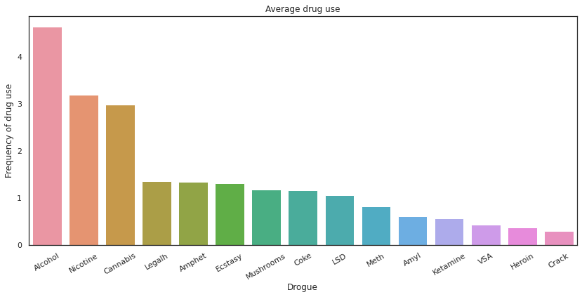
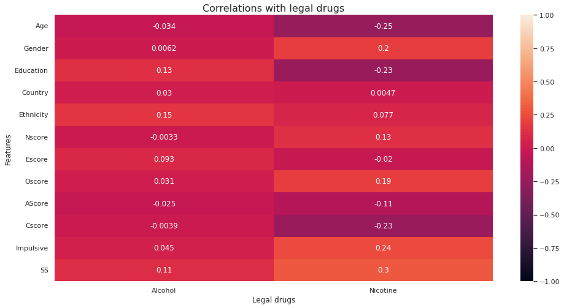
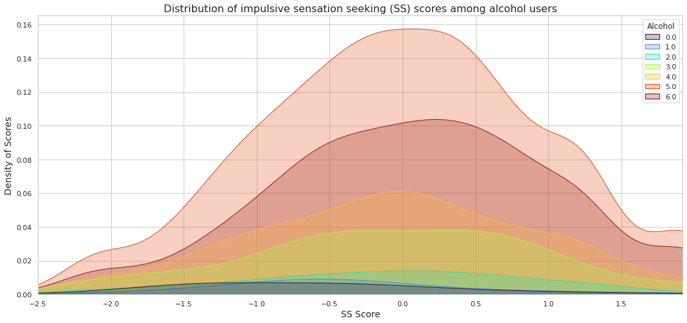
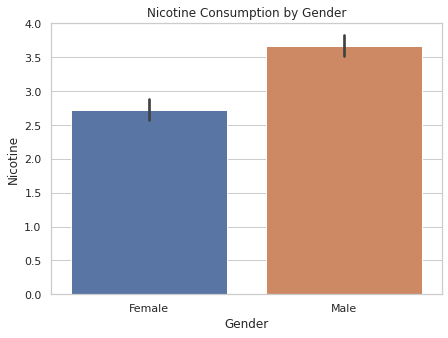
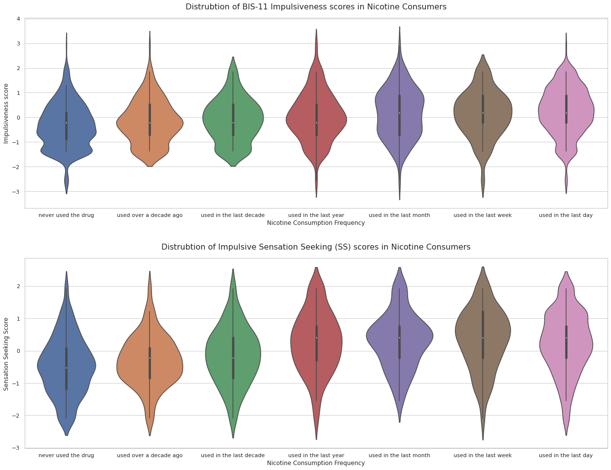
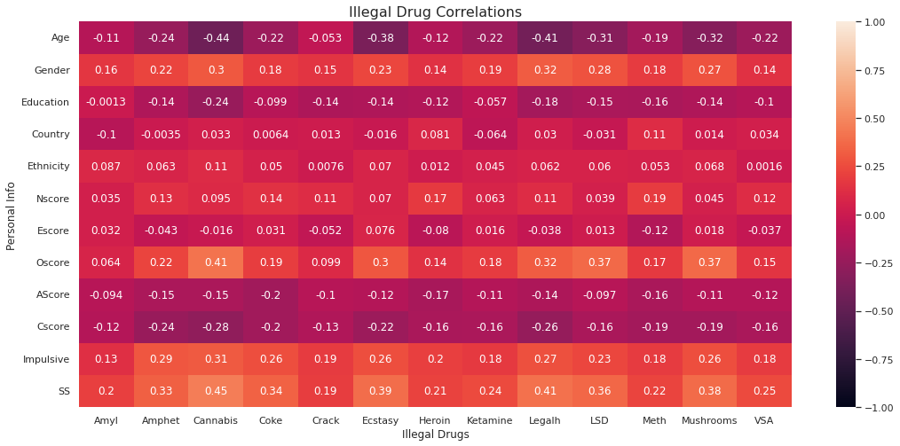
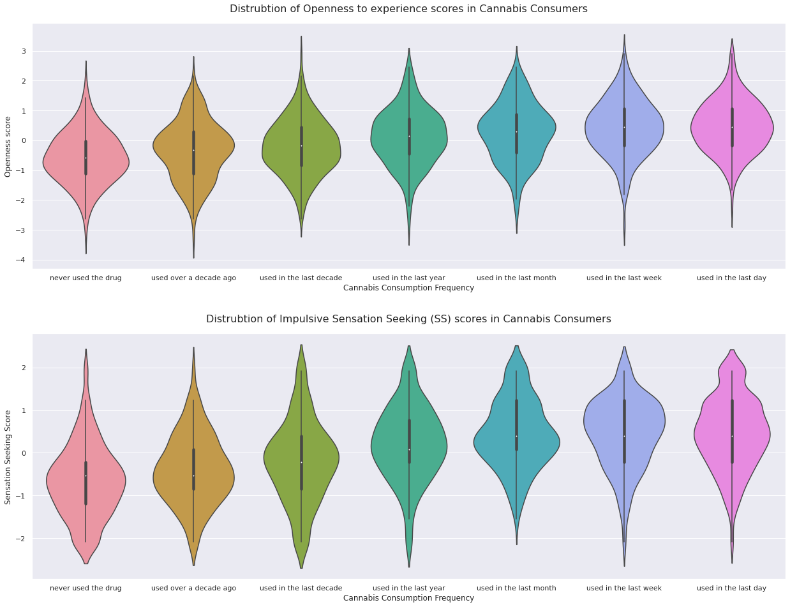
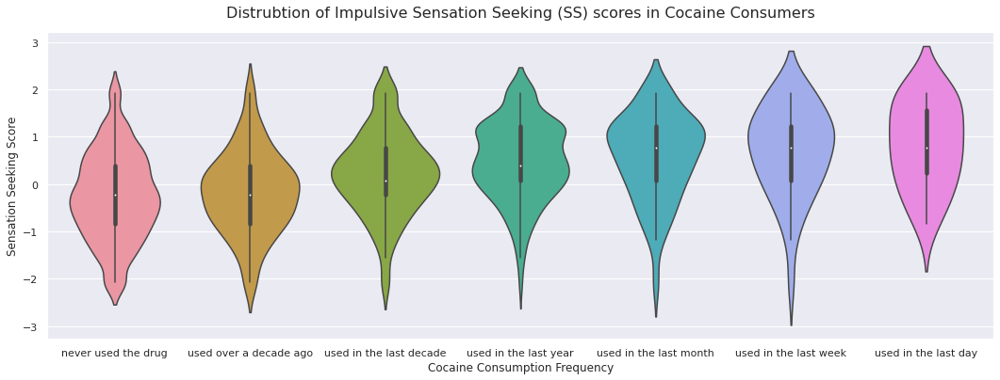

# AddicTest
AddicTest is an application that offers an interactive tool that allows you to simulate the risk of addiction using Machine Learning models.  

The data used consisted of several features such as collected personal information and psychological test results. As well as the level of legal and illegal drug use of more than 1880 participants, such as alcohol, nicotine, cannabis, cocaine, crack, ecstasy, heroin, etc.

## Data Analysis

### Overview

### Legal Drugs

- A **slight positive correlation** between **Nicotine** and **Sensation Seeking (SS)** score, as well as a less pronounced correlation with **Impulsivity**, **Oscore** and **Sex**.
- A **slight negative correlation** between **Nicotine** and **Age**, **Education** and **Cscore**.
- A **weak positive correlation** between **Alcohol** and **Sensation Seeking (SS)**, as well as **Ethnicity** and **Education**.
- Overall, the level of correlation between personal information and Alcohol are less pronounced than their level of correlation with Nicotine.

#### Alcohol

> _Drug Use Index :_
**0 :** Never used  
**1 :** Used over a decade ago  
**2 :** Used in the last decade  
**3 :** Used within last year  
**4 :** Used in the last month  
**5 :** Used in the last week  
**6 :** Used in the last day 

Frequent alcohol drinkers tend to have higher Sensation-Seeking (SS) scores, such that a majority of non-drinkers ("never drank" or "drank more than ten years ago") had an SS score close to -1.0 while frequent drinkers ("consumed a week ago" or "a day ago") tended to score between 0 and 0.25.

#### Nicotine

Nicotine shows a marked difference in consumption between the sexes, with men consuming more nicotine than women.

Nicotine consumption is positively correlated with both impulsivity score and SS score. With a slightly more pronounced relationship in Sensation Seeking (SS) scores.

### Illegal Drugs

A drug is classified as ‘illegal’ if it is forbidden by law. Different illegal drugs have different effects on people and these effects are influenced by many factors. This makes them unpredictable and dangerous, especially for young people.

Effects of each drug are influenced by the following :
1. The type of drug
2. Amount of consumption
3. What the person is doing while using the drugs
4. Individual characteristics such as body size and health/psychological vulnerabilities
5. How many different drugs are taken at one time   

#### Cannabis

#### Cocaine

